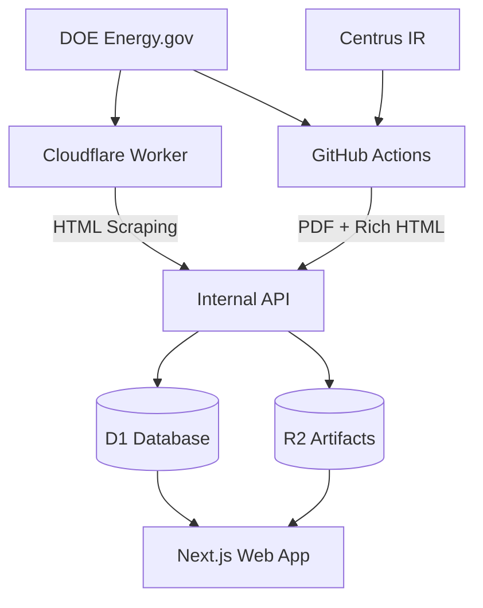

# HALEU Supply Watch - Data Ingestion Guide

This document outlines the comprehensive data ingestion pipeline for real HALEU allocation and delivery data.

## Overview

The system uses a hybrid approach combining Cloudflare Workers for lightweight scraping and GitHub Actions for heavy processing:

- **Worker Cron Jobs**: Hourly HTML scraping from DOE pages (lightweight, fast)
- **GitHub Actions**: PDF parsing and rich HTML processing (heavy lifting with Node.js libraries)
- **R2 Storage**: Raw artifact storage for complete data provenance
- **Webhook Authentication**: Secure internal API endpoints

## Data Sources

### Government & Regulatory (Authoritative)

1. **DOE HALEU Allocation Hub** (`doe-hub`)
   - URL: https://www.energy.gov/ne/us-department-energy-haleu-allocation-process
   - Type: Structured HTML with Round 1 & 2 selections
   - Update: Hourly via Worker cron + GitHub Actions

2. **DOE Press Releases** (`doe-pr-r1`, `doe-pr-r2`)
   - Round 1: https://www.energy.gov/articles/us-department-energy-distribute-first-amounts-haleu-us-advanced-reactor-developers
   - Round 2: https://www.energy.gov/articles/us-department-energy-distribute-next-round-haleu-us-nuclear-industry
   - Type: Structured press releases with dates and company names
   - Update: Via GitHub Actions

3. **DOE Allocation Process PDF** (`doe-pdf-process`)
   - URL: https://www.energy.gov/sites/default/files/2024-09/Final%20HALEU%20Allocation%20Process.pdf
   - Type: PDF with allocation schedule (21 MT by June 2026)
   - Update: Via GitHub Actions PDF parsing

### Industry & Vendor (Corroborative)

4. **Centrus Investor News** (`centrus-ir`)
   - URL: https://investors.centrusenergy.com/news-releases
   - Type: HTML news releases with production milestones
   - Update: Via GitHub Actions with conservative parsing

## Technical Architecture

### Worker-Based Ingestion (`apps/api/src/ingest/`)

```typescript
// energyGovHub.ts - Lightweight HTML scraping
export async function runDOEHubIngest(env: Env) {
  const html = await fetchDOEHubHTML();
  const allocations = parseAllocationsFromHub(html);
  
  // Store in R2 for provenance
  if (env.R2_ARTIFACTS) {
    await env.R2_ARTIFACTS.put(key, html);
  }
  
  // Import via internal API
  await fetch('/internal/import/allocations', {
    headers: { 'X-Webhook-Secret': env.WEBHOOK_ALLOCATIONS_SECRET }
  });
}
```

### GitHub Actions Processing (`scripts/ingest/`)

```typescript
// doe.ts - Heavy processing with Cheerio + PDF parsing
async function parseHubWithCheerio() {
  const $ = cheerio.load(html);
  // Robust parsing with structured selectors
}

async function parseAllocationPDF() {
  const data = await pdf(buffer);
  // Extract 21 MT schedule and milestones
}
```

### Authentication & Security

- **Webhook Secrets**: All internal endpoints require `X-Webhook-Secret` header
- **Rate Limiting**: Public endpoints have token bucket rate limiting
- **Idempotency**: Bulk imports use `Idempotency-Key` headers
- **CORS**: Configured for production domains

## Environment Variables

### Worker (Cloudflare)

```toml
# wrangler.toml
[vars]
API_RATE_LIMIT_PER_MIN = "60"

# Secrets (via wrangler secret put)
WEBHOOK_ALLOCATIONS_SECRET = "your-secret-here"
PUBLIC_BASE_URL = "https://hsw-api.your-domain.workers.dev"
```

### GitHub Actions

```yaml
# .github/workflows/ingest.yml
env:
  API_URL: https://hsw-api.your-domain.workers.dev
  WEBHOOK_ALLOCATIONS_SECRET: ${{ secrets.WEBHOOK_ALLOCATIONS_SECRET }}
```

## Deployment & Operations

### 1. Initial Setup

```bash
# Add data sources to production
wrangler d1 execute hsw --remote --file packages/database/seeds/sources.sql

# Set webhook secret
wrangler secret put WEBHOOK_ALLOCATIONS_SECRET

# Set public base URL
wrangler secret put PUBLIC_BASE_URL
```

### 2. Testing the Pipeline

```bash
# Test API endpoints
node scripts/test-ingest.js

# Manual trigger (requires webhook secret)
curl -X POST https://your-api.workers.dev/internal/ingest/doe \
  -H "X-Webhook-Secret: YOUR_SECRET"

# Check results
curl https://your-api.workers.dev/v1/allocations?limit=5
curl https://your-api.workers.dev/v1/changes?limit=10
```

### 3. Monitoring

- **Worker Logs**: View in Cloudflare Dashboard > Workers > hsw-api > Logs
- **GitHub Actions**: Check Actions tab for ingest workflow status
- **R2 Artifacts**: Browse raw data at Cloudflare R2 > hsw-artifacts/raw/
- **Database**: Query D1 directly or via API endpoints

## Data Flow



## API Endpoints

### Public (Rate Limited)

- `GET /v1/health` - System health
- `GET /v1/allocations` - Paginated allocations with filters
- `GET /v1/allocations/:id` - Single allocation with deliveries
- `GET /v1/changes` - Recent update events
- `GET /v1/sources` - Data source registry
- `GET /v1/documents/:id` - Document metadata

### Internal (Webhook Auth)

- `POST /internal/import/allocations` - Bulk allocation upsert
- `POST /internal/import/deliveries` - Bulk delivery upsert
- `POST /internal/ingest/doe` - Manual DOE ingest trigger

## Scaling Considerations

### Current Limits
- Worker: 100,000 requests/day (Free tier)
- D1: 5 million reads/day, 100,000 writes/day (Free tier)
- R2: 10GB storage, 1 million operations/month (Free tier)
- GitHub Actions: 2,000 minutes/month (Free tier)

### Future Scaling
- Move to Cloudflare Queues for job processing
- Use Durable Objects for advanced idempotency
- Consider separate ingest service for high-frequency updates
- Implement caching layer (KV) for frequently accessed data

## Error Handling & Reliability

- **Graceful Degradation**: If one source fails, others continue
- **Retry Logic**: Exponential backoff for network failures
- **Data Validation**: Zod schemas for all imports
- **Idempotency**: Safe to re-run imports multiple times
- **Logging**: Structured logs for debugging and monitoring
- **Alerting**: GitHub Actions send notifications on failure

## Data Quality & Provenance

- **Source Priority**: DOE > Industry > Other
- **Artifact Storage**: All raw data saved with timestamps and checksums
- **Change Tracking**: Every import creates update_event records
- **Duplicate Detection**: ID-based deduplication
- **Manual Override**: Admin can correct data via direct API calls

## Legal & Compliance

- **Public Domain**: DOE content is public domain (respectful scraping)
- **Robots.txt**: Respect robots.txt for all sources
- **Terms of Service**: Commercial sites (Centrus) scraped conservatively
- **Attribution**: Data sources clearly credited in UI
- **Frequency Limits**: Hourly updates to avoid overloading sources
